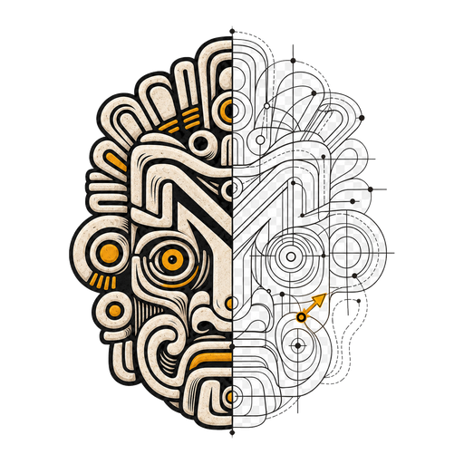

# MAYA

<p align="center">
  
</p>

**Most Advanced Yet Acceptable.**

MAYA is a design-direction skill for AI coding agents. It helps teams explore distinctive visual directions, critique existing interfaces, select a coherent design thesis, and turn that decision into durable product guidance and implementation primitives.

MAYA is one orchestrator skill with focused references for mobile, web, critique, evaluation, discovery, and design-system handoff. It can coordinate other design skills without merging their instructions into one oversized prompt.

## What MAYA does

- Frames the product, audience, task, constraints, and emotional intent before styling.
- Generates meaningfully different design directions at grounded, adjacent, and frontier distances.
- Supports optional random-seed exploration when the brief has no visual starting point.
- Produces comparable image probes for native mobile, web products, and brand websites.
- Uses a fresh-context critic to review probes and rendered implementations.
- Handles greenfield projects, unresolved work in progress, and existing redesigns.
- Converts an approved direction into `PRODUCT.md`, `DESIGN.md`, optional `BRAND.md`, and project-native tokens or components.
- Turns recurring feedback into design guidance, reusable mechanics, or deterministic checks.

## Workflow

1. **Frame** the stable product and platform constraints.
2. **Diverge** into distinct verbal directions, optionally using random seeds.
3. **Probe** shortlisted directions with matched content, state, task, and viewport.
4. **Critique** the rendered artifacts from a fresh context.
5. **Select** one dominant thesis with explicit preserve and reject decisions.
6. **Contract** the direction into durable guidance and executable primitives.
7. **Evaluate** the implementation against matched captures and recurring checks.

The skill stops for explicit direction approval before implementation.

## Installation

### Agent Skills CLI

Install MAYA directly from the public repository:

```bash
npx skills add https://github.com/florianrumigny/maya --skill maya
```

Reload your agent or start a new session after installation.

### Codex installer

You can also ask Codex:

```text
Install the maya skill from
https://github.com/florianrumigny/maya/tree/main/skills/maya
```

Or use Codex's bundled installer directly:

```bash
python ~/.codex/skills/.system/skill-installer/scripts/install-skill-from-github.py \
  --repo florianrumigny/maya \
  --path skills/maya
```

## Compatibility

MAYA follows the open Agent Skills format and is not limited to Codex. It can be installed in any compatible agent through the [Agent Skills CLI](https://github.com/vercel-labs/skills#supported-agents), including:

- Codex
- Claude Code
- Cursor
- GitHub Copilot
- Gemini CLI
- OpenCode
- Cline
- Windsurf

Run the standard installation command and select the agents where MAYA should be installed:

````bash
npx skills add florianrumigny/maya --skill maya

## Recommended companion skills

MAYA works on its own. The following tools unlock its full orchestration workflow.

### Impeccable

[Impeccable](https://impeccable.style/) provides product UX guidance, accessibility review, interface critique, hardening, and final polish.

```bash
npx impeccable install
````

Use Impeccable as the UX and quality authority while MAYA owns the direction process and selection record.

### Taste Skill

[Taste Skill](https://www.tasteskill.dev/) provides image-generation and implementation specialists for visual exploration.

Install the complete collection:

```bash
npx skills add https://github.com/Leonxlnx/taste-skill
```

Or install only the specialists relevant to your work:

```bash
# Native-mobile visual probes
npx skills add https://github.com/Leonxlnx/taste-skill --skill imagegen-frontend-mobile

# Web visual probes
npx skills add https://github.com/Leonxlnx/taste-skill --skill imagegen-frontend-web

# Identity and brand-board exploration
npx skills add https://github.com/Leonxlnx/taste-skill --skill brandkit

# Web-brand implementation
npx skills add https://github.com/Leonxlnx/taste-skill --skill design-taste-frontend
```

When Taste is unavailable, MAYA can use the environment's native image-generation capability as a fallback.

## Usage

Invoke the skill explicitly with `$maya`, or describe a matching design-direction task when automatic skill discovery is enabled.

### Start a mobile app from zero

```text
Use $maya for this new Expo app. I know the product and its main flow, but I
have no visual direction. Explore grounded, adjacent, and frontier directions
before we implement anything.
```

### Explore with random seeds

```text
Use $maya in seeded exploration mode. Keep the product behavior fixed and
surprise me with eight genuinely different visual directions.
```

### Continue an unresolved design

```text
Use $maya on this work in progress. Separate what is already decided from the
untested visual hypotheses, then help me choose a coherent axis.
```

### Redesign an existing interface

```text
Use $maya to critique the current interface, identify what should survive,
and compare preserve, evolve, and overhaul directions against the same baseline.
```

### Create the durable design contract

```text
The direction is approved. Use $maya to propose the smallest useful set of
PRODUCT.md, DESIGN.md, brand guidance, tokens, themes, components, and checks.
Show me the proposed file changes before writing them.
```

## Architecture

```text
skills/maya/
├── SKILL.md
├── agents/
│   └── openai.yaml
├── assets/
│   └── brand/
│       ├── maya-icon.png
│       ├── maya-logo-symbol.svg
│       ├── maya-logo-primary.png
│       └── logo variants
├── references/
│   ├── critic-loop.md
│   ├── design-contract.md
│   ├── discovery.md
│   ├── evaluation-loop.md
│   ├── mobile.md
│   └── web.md
└── scripts/
    ├── build-brand-assets.py
    └── generate-seeds.mjs
```

The entrypoint contains routing and completion criteria. Branch-specific guidance stays in references so agents load only what the current design task needs.

## Brand assets

MAYA's symbol is a **relic in construction**: one half is resolved and expressive; the other exposes the geometry, alternatives, and decision points behind it. The embedded `M` connects both halves.

- Use `maya-logo-primary.png` for large presentations and repository artwork.
- Use `maya-icon.png` or `maya-logo-symbol.svg` at small sizes.
- Use the light, dark, or monochrome variants when the primary mark lacks contrast.
- See [BRAND.md](BRAND.md) for the palette, spacing, minimum sizes, and asset map.

## Inspirations

MAYA was informed by:

- Raymond Loewy's **Most Advanced Yet Acceptable** principle.
- Lenny Rachitsky's article on turning AI into a stronger product designer.
- Vercel's `design.md`, bounded stylesheet, and evaluation-loop approach.
- Matt Pocock's `writing-for-agents` guidance on progressive disclosure and agent-readable instructions.
- [Impeccable](https://impeccable.style/) and [Taste Skill](https://www.tasteskill.dev/) as complementary design specialists.

MAYA is an independent project and is not affiliated with these authors or projects.

## License

[MIT](LICENSE). You may use, modify, and distribute the skill with attribution.
